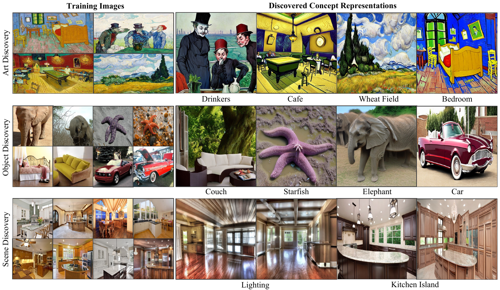
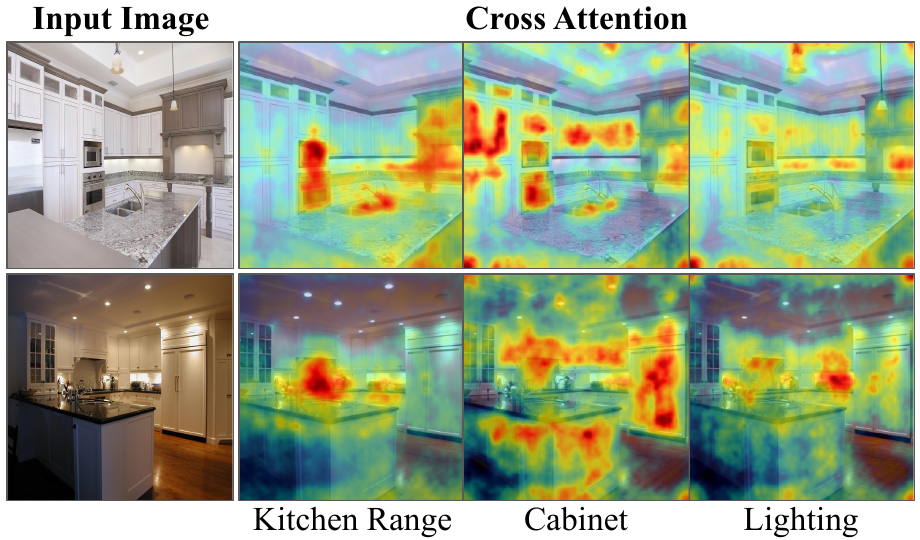
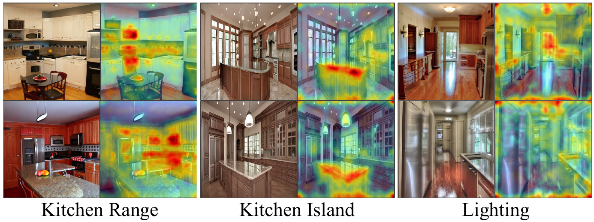

# Unsupervised Compositional Concepts Discovery <br> (ICCV 2023)

<a href="https://energy-based-model.github.io/unsupervised-concept-discovery"></a> 
<a href="https://arxiv.org/abs/2306.05357"></a>

> Text-to-image generative models have enabled high-resolution image synthesis across different domains, but require users to specify the content they wish to generate. In this paper, we consider the inverse problem -- given a collection of different images, can we discover the generative concepts that represent each image? We present an unsupervised approach to discover generative concepts from a collection of images, disentangling different art styles in paintings, objects, and lighting from kitchen scenes, and discovering image classes given ImageNet images. We show how such generative concepts can accurately represent the content of images, be recombined and composed to generate new artistic and hybrid images, and be further used as a representation for downstream classification tasks.  

[Unsupervised Compositional Concepts Discovery with Text-to-Image Generative Models](https://energy-based-model.github.io/unsupervised-concept-discovery)
    <br>
    [Nan Liu](https://nanliu.io) <sup>1*</sup>,
    [Yilun Du](https://yilundu.github.io) <sup>2*</sup>,
    [Shuang Li](https://people.csail.mit.edu/lishuang) <sup>2*</sup>,
    [Joshua B. Tenenbaum](https://mitibmwatsonailab.mit.edu/people/joshua-tenenbaum/) <sup>2</sup>,
    [Antonio Torralba](https://groups.csail.mit.edu/vision/torralbalab/) <sup>2</sup>
    <br>
    <sup>*</sup> Equal Contribution
    <br>
    <sup>1</sup>UIUC, <sup>2</sup>MIT CSAIL
    <br>
    ICCV 2023
    <br>

https://github.com/nanlliu/Unsupervised-Compositional-Concepts-Discovery/assets/45443761/ca2504a2-2186-4edd-b37c-2b4e9c503a1b


## Todo

- [ ] Fix requirements.txt
- [ ] Add support to other available models such as deepfloyd and StableDiffusionXL.


## Setup

Run following to create a conda environment, and activate it:

    conda create --name decomp python=3.8
    conda activate decomp

Next, install the required packages:

    pip install -r requirements.txt


## Training

After downloading images (e.g., ImageNet class folders) into the `repo directory`, you first specify some data arguments:

    model_path="stabilityai/stable-diffusion-2-1-base"
    train_data_dir="imagenet,imagenet,imagenet,imagenet,imagenet"
    placeholder_tokens="<t1>,<t2>,<t3>,<t4>,<t5>"
    class_folder_names="n09288635,n02085620,n02481823,n04204347,n03788195" 
    learnable_property="object,object,object,object,object"
    output_dir=$OUTPUT_DIR

Then you can train a model on ImageNet $S_1$ by running:

    DEVICE=$CUDA_VISIBLE_DEVICES
    python create_accelerate_config.py --gpu_id "${DEVICE}"
    accelerate launch --config_file accelerate_config.yaml main.py \
    --pretrained_model_name_or_path "${model_path}" \
    --train_data_dir ${train_data_dir}  \
    --placeholder_tokens ${placeholder_tokens} \
    --resolution=512  --class_folder_names ${class_folder_names} \
    --train_batch_size=2 --gradient_accumulation_steps=8 --repeats 1 \
    --learning_rate=5.0e-03 --scale_lr --lr_scheduler="constant" --max_train_steps 3000 \
    --lr_warmup_steps=0   --output_dir ${output_dir} \
    --learnable_property "${learnable_property}"  \
    --checkpointing_steps 1000 --mse_coeff 1 --seed 0 \
    --add_weight_per_score \
    --use_conj_score --init_weight 5 \
    --validation_step 1000 \
    --num_iters_per_image 120 --num_images_per_class 5

See more training details about training in ```scripts``` folder. 

Training dataset for artistic paintings can be found [here](https://www.dropbox.com/sh/g91atmeuy2ihkgn/AAATmXz6zI9H4fLCnsEG-CRka?dl=0).

## Inference


Once model is trained, we can sample from each concept using following command:

    python inference.py --model_path ${output_dir} --prompts "a photo of <t1>" "a photo of <t2>" "a photo of <t3>" "a photo of <t4>" "a photo of <t5>" --num_images 64 --bsz 8

## Visualization

DDIM + DAAM (Training Data)             |  DAAM (Generated Data)
:-------------------------:|:-------------------------:
 | 

Once concepts are learned, we can generate cross-attention heap maps between training image and learned concepts using diffusion attentive attribution maps ([DAAM](https://github.com/castorini/daam)) for visualization:

    python daam_ddim_visualize.py --model_path ${output_dir} --image_path $IMG_PATH --prompt "a photo of <t1>" --keyword "<t1>" --scale 7.5 --num_images 1 --seed 0

Generate images along with heap map visualizations associated with each learned concept using DAAM:

    python daam_visualize_generation.py --model_path ${output_dir} --prompt "a photo of <t1>" --keyword "<t1>" --scale 7.5 --num_images 1 --seed 0

## Evaluation 

After we generate 64 images per concept, we can run following command to evaluate classification accuracy and KL divergence using pre-trained ResNet-50 and CLIP with specified threshold values:

    # CLIP
    python eval.py --model_path ${output_dir} --evaluation_metric clip --class_names "geyser" "chihuahua" "chimpanzee" "shopping cart" "mosque" --logit_threshold 0.3
    # ResNet-50
    python eval.py --model_path ${output_dir} --evaluation_metric resnet --class_names "geyser" "chihuahua" "chimpanzee" "shopping cart" "mosque" --logit_threshold 10


## Citation
    @article{liu2023unsupervised,
        author = {Liu, Nan and Du, Yilun and Li, Shuang and Tenenbaum, Joshua B and Torralba, Antonio},
        title = {Unsupervised Compositional Concepts Discovery with Text-to-Image Generative Models},
        journal = {arXiv preprint arXiv:2306.05357},
        year = {2023},
    }

Feel free to let us know if we are missing any relevant citations.
